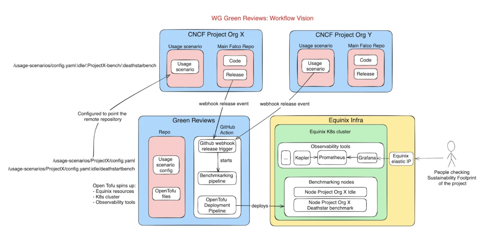

# CNCF Green Reviews WG

The CNCF Green Reviews Working Group (WG) is an open-source, community-led project that is part of the [CNCF Environmental Sustainability Technical Advisory Group (TAG ENV)](https://github.com/cncf/tag-env-sustainability).

The aim of the Green Reviews WG is to set up infrastructure to measure the sustainability footprint of [CNCF Projects](https://www.cncf.io/projects).

Measuring the sustainability footprint of software is not an easy task. Our vision is that the WG will compute the sustainability data for every release of a CNCF project that requests a sustainability footprint assessment. To achieve such a vision, our goal is to develop a workflow that can integrate well with the existing software lifecycle of other CNCF projects.

A good way to practically understand the first version of the workflow that the WG is designing is to take a look at the following architecture diagram:

The WG’s workflow vision is that every release requesting a sustainability footprint assessment will trigger a Github Action specified in the Green Reviews repo that will start a benchmarking pipeline. The pipeline’s job is to:

1. Spin up the Equinix Metal resources
2. Install Kubernetes and all the needed observability tools
3. Install the software that will be assessed
4. Execute the necessary benchmark test cases
5. Gather sustainability-related metrics
6. Publish sustainability metrics

If you are curious and want to discover more, here are some good resources:
- You can read the deep dive [article](https://tag-env-sustainability.cncf.io/blog/2024-green-reviews-working-group-measuring-sustainability/)
- You can watch the Kubecon EU '24 [Maintainer Talk](https://www.youtube.com/watch?v=UFa8hxOGKwQ)

## Releases

| Release | Date | Notes
|---|---|---|
| 0.1.0 | 14.05.24 | [Release Notes](https://github.com/cncf-tags/green-reviews-tooling/releases/tag/0.1.0)
| 0.2.0 | Planned before Kubecon NA '24 | [Tracking issue](https://github.com/cncf-tags/green-reviews-tooling/issues/83)

## Community

### Getting Started

Here are some resources to learn about the project:

- **Charter**: The [Green Reviews WG Charter](https://github.com/cncf/tag-env-sustainability/blob/main/working-groups/green-reviews/charter.md) outlines the WG's motivation, scope, goals, non-goals, and deliverables.
- **Issue Board**: Checkout the project's [Backlog](https://github.com/orgs/cncf-tags/projects/5) to find something to work on.

### Contributing

All contributions are welcome, including code contributions, issues, suggestions, questions, product direction, collaborations, etc.

If you are interested in contributing to the project, head over to the [Contributing Guide](./CONTRIBUTING.md)!

### Documentation

All changes to the documentation must be added to the [docs](./docs/) folder.

## Roadmap

The [roadmap](https://github.com/orgs/cncf-tags/projects/5/views/7) contains some of the goals of the Green Reviews WG. Timelines are estimates and may change.
