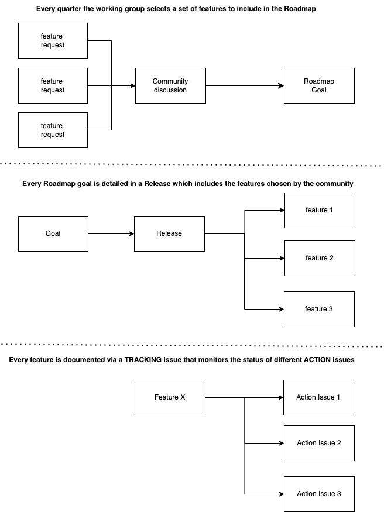

# Governance

This document attempts to describe the governance framework adopting for contributing to this repo.
Please let us know if something is not clear or if you like to propose any kind of improvements.

The working group follows the Roadmap that can be find in the root Readme. 

1. At any point in time any person can submit a feature request via issue
2. Every quarter the working group aims at releasing a new project version
3. At the beginning of every quarter the working group engages in a formal discussion to decide which features should be included in the quarter release
4. Every feature is mapped into a TRACKIUNG issue monitoring the status of the feature
5. Every tracking issue will have a set of ACTION issues that will detail the steps needed to build the feature
6. ACTION issues can be marked as `good first issues` for beginner friendly contributions
7. Each ACTION issue will be closed after the submission of a formal PR approved by the wg-leads

Please find attached below a picture that summirizes this process. 

