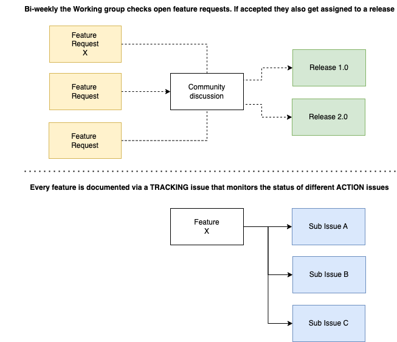

# Planning Features

This document describes the feature planning process for contributing to this repo.
Please let us know if something is not clear or if you like to propose any kind of improvements.

The working group follows the Roadmap that can be find in the root Readme. 

1. At any point in time any person can submit a feature request via issue
2. Every quarter the working group aims at releasing a new project release
3. Bi-weekly the Working group checks open feature requests. If accepted they also get assigned to a release.
4. Feature requests can have [sub-issues](https://docs.github.com/en/issues/tracking-your-work-with-issues/using-issues/adding-sub-issues) that may provide more detail for the steps needed to build the feature
5. Feature requests should have enough detail so that they can be marked as `good first issues` for new contributors
6. Each feature request will be closed after the submission of a formal PR approved by the wg-leads

Please find attached below a picture that summirizes this process. 

