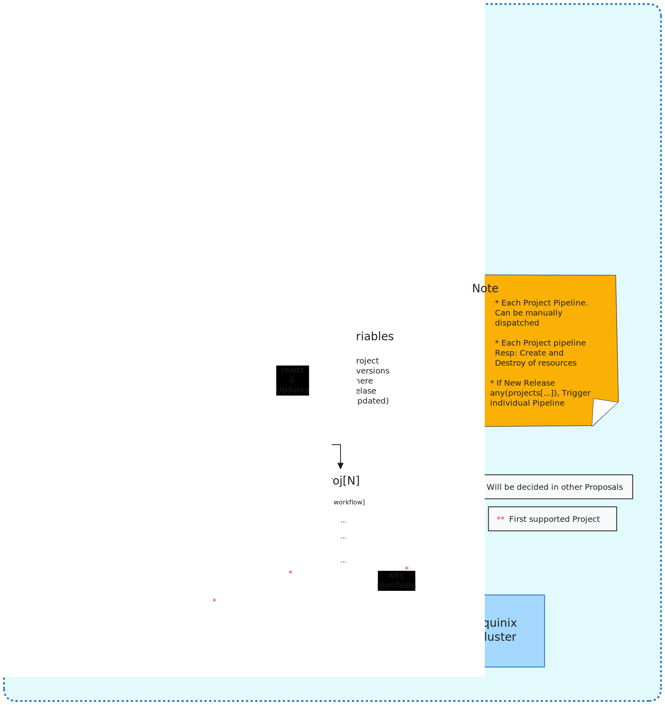

# Proposal-001 - Trigger and Deploy GitHub Action workflow from an upstream CNCF project

Trigger the Green Reviews pipeline to run when a particular CNCF project gets certain kinds of event, such as a new `release`.

- Tracking issue: [#83](https://github.com/cncf-tags/green-reviews-tooling/issues/83)
- Implementation issue: [#84](https://github.com/cncf-tags/green-reviews-tooling/issues/84)

## Authors

- @rossf7
- @dipankardas011

## Status

implementable

<!--
Must be one of provisional, implementable, implemented, deferred,
rejected, withdrawn, or replaced.
-->

## Table of Contents
<!-- toc -->
- [Summary](#summary)
- [Motivation](#motivation)
  - [Goals](#goals)
  - [Non-Goals](#non-goals)
  - [Linked Docs](#linked-docs)
- [Proposal](#proposal)
  - [User Stories](#user-stories)
  - [Risks and Mitigations](#risks-and-mitigations)
- [Design Details](#design-details)
  - [Graduation Criteria (Optional)](#graduation-criteria-optional)
- [Drawbacks (Optional)](#drawbacks-optional)
- [Alternatives](#alternatives)
- [Infrastructure Needed](#infrastructure-needed)
<!-- /toc -->

## Summary

This proposal focuses on automating the Green Reviews pipeline for Falco by 
defining a trigger mechanism, deploying Falco using Flux, and deleting the
resources at the end of the pipeline run. The pipeline will support more CNCF
projects as they are onboarded.

This proposal doesn't cover running benchmark tests or reporting metrics which
are described in separate proposals.

## Motivation

In the current implementation Falco is permanently deployed using Flux. With
the new deployment approach it is only deployed when there is a new version
to benchmark.

This lets us use the cluster resources more efficiently and enables benchmarking
multiple configurations of Falco and more CNCF projects as they are onboarded.

### Goals

- Trigger the pipeline when a new release of a project happens
- Allow additional runs of the pipeline by calling a GitHub webhook
- Deploy the new version of the project using flux
- Delete the resources at the end of the pipeline run
- Communicate changes to the deployment process needing to be made by the Falco
team
- Document the solution including how to onboard new projects

### Non-Goals

- Creating cluster nodes on demand. [Future Goal Issue #67](https://github.com/cncf-tags/green-reviews-tooling/issues/67)

### Linked Docs

- **Slack Discussion Thread** [Link](https://cloud-native.slack.com/archives/C060EDHN431/p1712765271470189)

## Proposal

We will watch for new releases of the project via the GitHub REST API
e.g. https://api.github.com/repos/falcosecurity/falco/releases/latest

Our automation will call the GitHub REST API to trigger the pipeline.

The maintainers of the CNCF projects will also be able to call this webhook
using a fine grained access token we will provide.

This can be used to trigger the pipeline ad-hoc during development and can be
added to their CI/CD pipeline if additional trigger points are required.

### User Stories

#### Project maintainer creates new release to be measured

Our automation detects a new release was published and triggers the pipeline.

#### Project maintainer deploys their project so it can be measured

Participating CNCF projects will deploy their project using a gitops approach
with flux.

#### Project maintainer triggers pipeline to test a new benchmark

Calling the webhook will trigger the pipeline allowing the changes to be tested.

### Risks and Mitigations

Multiple deployments will produce inaccurate results as we can only accurately
measure a single project per node. We can set [concurrency](https://docs.github.com/en/actions/using-jobs/using-concurrency)
in the workflow to ensure only a single instance runs at a time.

Uninstall at end of pipeline fails. We can wait till all flux finalizers are
removed. In future we could create nodes on demand and delete on completion.

## Design Details



### Subscribing to Releases

A YAML file of CNCF projects and any sub components will be stored in the
tooling repo e.g.

```yaml
# projects.yaml
projects:
  - name: falco
    sub_components:
      - ebpf
      - modern-ebpf
      - kmod
```

A scheduled GitHub Action will run weekly and check the GitHub REST API of each
project for new releases.

e.g. https://api.github.com/repos/falcosecurity/falco/releases/latest

To manage the state a GitHub [repository variable](https://docs.github.com/en/actions/learn-github-actions/variables)
per CNCF project is used to store the latest release version.

If a new release is detected the action will trigger the pipeline for the new
release and update the variable with the new version. This is to ensure each
release is only triggered once.

If sub components are specified then the pipeline will be triggered once per
sub component.

### Trigger

The green reviews pipeline will be triggered by sending a [workflow_dispatch](https://docs.github.com/en/rest/actions/workflows?apiVersion=2022-11-28#create-a-workflow-dispatch-event)
event via the GitHub REST API.

Inputs are

- `cncf_project`: **required** Project to be deployed e.g. `falco`
- `cncf_project_sub`: **optional** Subcomponent if project has multiple variants
they wish to test e.g. Falco wish to test 3 falco drivers `modern-ebpf`, `kmod`
and `ebpf`
- `version`: **required** Version of project to be tested e.g. `0.37.0`

```sh
curl -X POST \
     -H "Accept: application/vnd.github.v3+json" \
     -H "Authorization: token $GITHUB_PAT" \
     https://api.github.com/repos/cncf-tags/green-reviews-tooling/actions/workflows/pipeline.yaml/dispatches \
     -d '{"ref":"0.2.0", "inputs": {"cncf_project": "falco", "cncf_project_sub": "modern-ebpf","version":"0.37.0"}}'
```

The pipeline is versioned by creating releases of the `green-reviews-tooling`
repo. The git tag to use is passed via the `ref` param.

The CNCF projects will be given a GitHub fine grained access token limited to
the `green-reviews-tooling` repo. This token will have

- Read access to code and metadata
- Read write access to actions

### Deploy

Flux is used to deploy the CNCF project. Projects are able to use either
`kustomization` or `helmrelease` resources to deploy their project.

When the pipeline executes it will look for manifest files in the projects dir.
If there is a manifest matching the `cncf_project` input its contents will be
applied using kubectl. The same applies for the `cncf_project_sub` input. 

The `version` param is injected into the files to ensure the correct version of
the project is deployed. (For these minor changes we can utilize kustomize)

```
projects
└── falco
    ├── ebpf.yaml
    ├── falco.yaml
    ├── kmod.yaml
    └── modern-ebpf.yaml
```

The pipeline will use a GitHub secret that has a kubeconfig to access the
green reviews cluster and the manifests will be applied using `kubectl apply -f`.

We then need to wait for the flux resources to be reconciled. This is done
using `kubectl wait` and by waiting for all kustomization or helmrelease
resources in the target namespace e.g. `falco` to be ready.

We will use [concurrency](https://docs.github.com/en/actions/using-jobs/using-concurrency)
to only allow a single execution of the pipeline at any one time.

### Cleanup

On completion of the pipeline run, whether it was successful or failed, the CNCF
project resources will be deleted by deleting their flux resources.

A successful pipeline run is once the necessary metrics have been written to
long term storage. This will be covered by proposal 3 [Report](https://github.com/cncf-tags/green-reviews-tooling/issues/95).

The same logic using the `cncf_project` and `cncf_project_sub` inputs will be
used to select which manifests should be deleted. The manifests will be deleted
using `kubectl delete -f --wait` so we wait for finalizers.

This is to ensure that the cluster state is clean before the next execution of
the pipeline.

## Drawbacks

The pull based approach means there can be up to an hour delay before a new
release is measured.

If this is too long the CNCF projects can trigger the pipeline using the GitHub
REST API with the access token we provide.

## Alternatives

Initially a solely push based solution was proposed but there was concern this
would require CNCF projects to make changes to their CI/CD pipelines.

The pull based solution of subscribing to project releases was added. The downside
to this is the delay in triggering the pipeline.

## Infrastructure Needed

A GitHub access token for CNCF projects to trigger a Green Review. Either for
testing changes or to add the trigger to their CI/CD pipeline.
