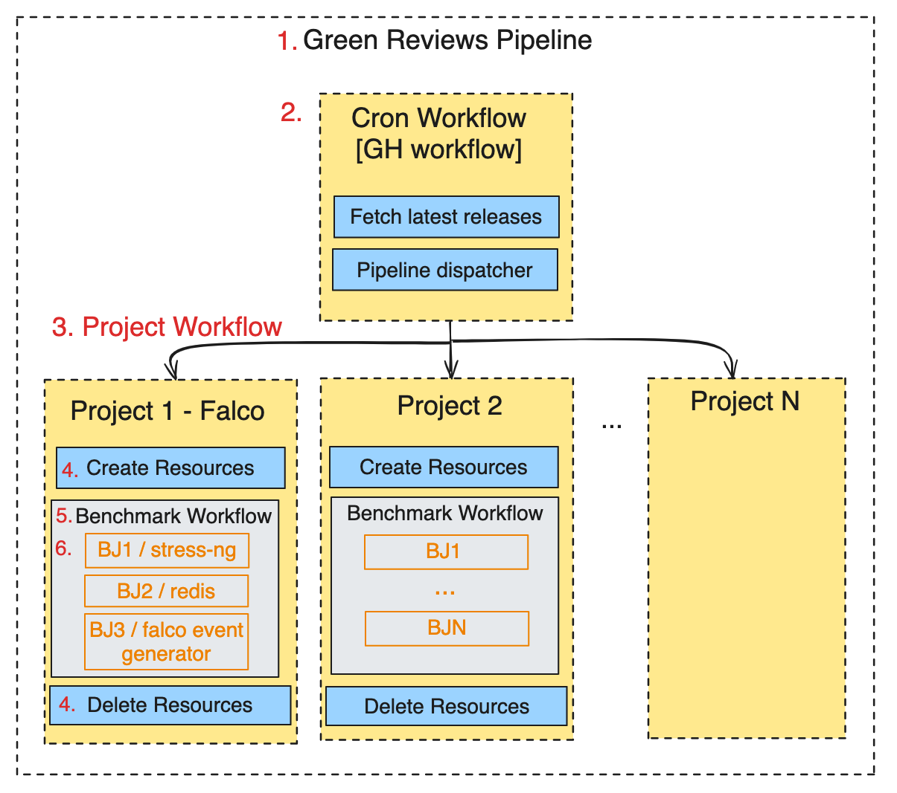
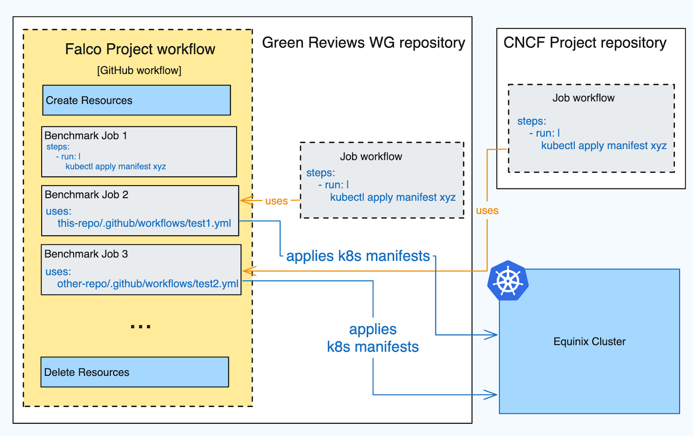
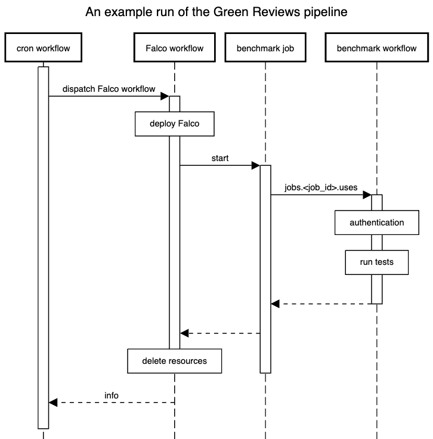

# Proposal 002 - Run the CNCF project benchmark tests as part of the automated pipeline

This is step two from the automated pipeline which evaluates the carbon emissions of a CNCF project: run benchmarking tests of the project (probably created for this purpose).
See also step 1: [Trigger and Deploy](https://github.com/cncf-tags/green-reviews-tooling/pull/88).
- Tracking issue: [#83](https://github.com/cncf-tags/green-reviews-tooling/issues/83)
- Implementation issue: [#86](https://github.com/cncf-tags/green-reviews-tooling/issues/86)

## Authors

- @locomundo
- @nikimanoledaki

## Status

Draft

## Table of Contents
<!-- toc -->
- [Proposal 002 - Run the CNCF project benchmark tests as part of the automated pipeline](#proposal-002---run-the-cncf-project-benchmark-tests-as-part-of-the-automated-pipeline)
  - [Authors](#authors)
  - [Status](#status)
  - [Table of Contents](#table-of-contents)
  - [Summary](#summary)
  - [Motivation](#motivation)
    - [Goals](#goals)
    - [Non-Goals](#non-goals)
    - [Linked Docs](#linked-docs)
  - [Proposal](#proposal)
    - [User Stories](#user-stories)
    - [Notes/Constraints/Caveats (Optional)](#notesconstraintscaveats-optional)
    - [Risks and Mitigations](#risks-and-mitigations)
  - [Design Details](#design-details)
    - [Definitions](#definitions)
    - [Calling the test workflow](#calling-the-test-workflow)
      - [Use Case 1: A GitHub Action job using a workflow defined in the _same_ repository (preferred)](#use-case-1-a-github-action-job-using-a-workflow-defined-in-the-same-repository-preferred)
      - [Use Case 2: A GitHub Action job using a workflow defined in a _different_ repository](#use-case-2-a-github-action-job-using-a-workflow-defined-in-a-different-repository)
    - [Test instructions](#test-instructions)
    - [Authentication](#authentication)
    - [Versioning](#versioning)
  - [Drawbacks (Optional)](#drawbacks-optional)
  - [Alternatives](#alternatives)
  - [Infrastructure Needed (Optional)](#infrastructure-needed-optional)
<!-- /toc -->

## Summary

<!--
A good summary is at least a paragraph in length and should be written with a wide audience
in mind.

It should encompass the entire document, and serve as both future documentation
and as a quick reference for people coming by to learn the proposal's purpose
without reading the entire thing.

Both in this section and below, follow the guidelines of the [documentation
style guide]. In particular, wrap lines to a reasonable length, to make it
easier for reviewers to cite specific portions, and to minimize diff churn on
updates.

[documentation style guide]: https://github.com/kubernetes/community/blob/master/contributors/guide/style-guide.md
-->

## Motivation

<!--
This section is for explicitly listing the motivation, goals and non-goals of
this proposal. Describe why the change is important, how it fits into the project's
goals and the benefits to users.

It is helpful to frame this to answer the question: "What is the problem this proposal
is trying to solve?"
-->

This proposal is part of the pipeline automation of the Green Reviews tooling for Falco (and new CNCF projects in the future). Currently, we are using Flux to watch the upstream Falco repository and run the benchmark tests constantly. For example, [this benchmark test](https://github.com/falcosecurity/cncf-green-review-testing/blob/main/kustomize/falco-driver/ebpf/stress-ng.yaml#L27-L32) is set up as a Kubernetes Deployment that runs an endless loop of [`stress-ng`](https://wiki.ubuntu.com/Kernel/Reference/stress-ng), which applies stress to the kernel. Instead, this proposal aims to provide a solution for how to deploy the benchmark tests only when they are needed.

Secondly, automating the way we run benchmark tests in this pipeline will help to make it easier and faster to add new benchmark tests. It will enable both the WG Green Reviews and CNCF project maintainers to come up with new benchmark tests and run them to get feedback faster.

### Goals

<!--
List the specific goals of the proposal. What is it trying to achieve? How will we
know that this has succeeded?
-->

  - Describe the actions to take immediately after the trigger and deployment of the CNCF project defined in [Proposal 1](./proposal-001-trigger-and-deploy.md)
  - Describe how the pipeline should _fetch_ the benchmark tests either from this repository (`cncf-tags/green-reviews-tooling`) or from an upstream repository (e.g. Falco's [`falcosecurity/cncf-green-review-testing`](https://github.com/falcosecurity/cncf-green-review-testing)).
  - Describe how the pipeline should _run_ the benchmark tests through GitHub Actions for a specific project e.g. Falco
  - Communicate the changes needed to be made by the Falco team to change the benchmark test to a GitHub Action file.
  - Provide _modularity_ for the benchmark tests.

### Non-Goals

<!--
What is out of scope for this proposal? Listing non-goals helps to focus discussion
and make progress.

It is important to remember that non-goals are still equally important things
which will be dealt with one day but are not things which need to be dealt with immediately
within the scope of this work. This helps make sure everyone is crystal clear on the outcomes.
-->

* Defining or designing the content of benchmark tests themselves, or assigning responsibility for who should write them.

### Linked Docs

<!--
Provide links to previous discussions, Slack threads, motivation issues or any other document
with context. It is really helpful to provide a "source of truth" for the work
so that people aren't searching all over the place for lost context.
-->


## Proposal

<!--
This is where we get down to the specifics of what the proposal actually is:
outlining your solution to the problem described in the Motivation section.
This should have enough detail that reviewers can understand exactly what
you're proposing, but should not include things like API designs or
implementation. The "Design Details" section below is for the real
nitty-gritty.
-->

### User Stories

<!--
Detail the things that people will be able to do if this proposal is implemented.
Include as much detail as possible so that people can understand the "how" of
the system. The goal here is to make this feel real for users without getting
bogged down.
-->

**CNCF project maintainer selects the right benchmark for their project**

Since different CNCF projects need different benchmarks to reproduce the right metrics, as a project maintainer, I would like to select the benchmarks reproducing a k8s context as realistic as possible.

**CNCF project maintainer creates a new benchmark for their project**

If the available benchmarks are not enough to set a realistic context, I would like to create and run my own benchmark


**Green Reviews maintainer helps to create a new benchmark test for a specific CNCF project**

As a Green Reviews maintainer, I can help a CNCF project maintainers to define the Functional Unit of a project so that the project maintainers can create a benchmark test.

**CNCF Project maintainer modifies or removes a benchmark test**

As a project maintainer, I can edit or remove a benchmark test if it is in a repository owned by the CNCF project itself, or otherwise if it’s in the Green Reviews repository by making a pull request with the changes.


<!--
As a Green Review WG reviewer,

As a Green Review WG cluster maintainer, -->

### Notes/Constraints/Caveats (Optional)

<!--
What are the caveats to the proposal?
What are some important details that didn't come across above?
Go in to as much detail as necessary here.
This might be a good place to talk about core concepts and how they relate.
-->

### Risks and Mitigations

<!--
What are the risks of this proposal, and how do we mitigate?
Think broadly.  For example, consider how this will impact or be impacted
by scaling to support more CNCF Projects.

How will this affect the benchmark tests, CNCF Project Maintainers, pipeline maintainers, etc?
-->

As with every design document, there are multiple risks:

- Extensibility: At the moment Falco is the first and only project that requested a Green Review (very appreciated guinea pig 🙂). When other CNCF projects will request other Green Reviews, we will learn more and adapt the project as needed.

- Scalability: Green Reviews contributors should empower and encourage CNCF project maintainers to create benchmark tests. The right collaboration will enable Green Reviews maintainers to scale to multiple projects (cause they will not need to understand the deployment details of every project) while producing higher quality metrics (cause the project is set up by the experts).

- Validity: this point is less trivial and also conflicting with the one above but worth mention. If every single project defines its own benchmarks how will it be possible to compare different Projects result? This needs [deeper investigation that will be discussed in a separate proposal](https://github.com/cncf-tags/green-reviews-tooling/issues/103.)


## Design Details

<!--
This section should contain enough information that the specifics of your
change are understandable. This may include manifests or workflow examples
(though not always required) or even code snippets. If there's any ambiguity
about HOW your proposal will be implemented, this is the place to discuss them.
-->

The Green Reviews automated pipeline relies on putting together different reusable GitHub Action workflows to modularise the different moving parts. A workflow runs one or more jobs, and each job runs one or more actions. It may be helpful to familiarise oneself with the documentation on [GitHub Action workflows](https://docs.github.com/en/actions/using-workflows/about-workflows) and especially [Reusing workflows](https://docs.github.com/en/actions/using-workflows/reusing-workflows) first to better understand the rest of the proposal as it explains some of these concepts well.  The section on [Calling reusable workflows](https://docs.github.com/en/actions/using-workflows/reusing-workflows#calling-a-reusable-workflow) describes an important concept that will be referenced later in this proposal.

### Definitions

There are different components defined here and shown in the following diagram.



Let's recap some of the components defined in [Proposal 1](proposal-001-trigger-and-deploy.md):
1. **Green Reviews pipeline**: the Continuous Integration pipeline which deploys a CNCF project to a test cluster, runs a set of benchmarks while measuring carbon emissions and stores the results. It is implemented by the workflows listed below.
2. **Cron workflow**: This refers to the initial GitHub Action workflow (described in proposal 1) and which dispatches a project workflow (see next definition), as well as a delete workflow to clean up the resources created by the project workflow.
3. **Project workflow**: The project workflow is dispatched by the Cron workflow. A project workflow can be, for example, a Falco workflow. A project workflow deploys the project and calls the test workflow (see below). A project workflow can be dispatched more than once if there are multiple project variants/setups. In addition, a Project workflow, which is also just another GitHub Action workflow, contains a list of GitHub Action Jobs. These are a list of test jobs - more info below.
4. **Delete/cleanup workflow**: This is the one to make sure that the resources created by the project workflow are deleted so the environments go back to the initial state.

This proposal adds the following components:
1. **[new] Test job**: A test job is an instance of a GitHub Action Job. It is called right after deploying the CNCF project from the test workflow. The test job runs the test workflow and instructions for a CNCF project. Which benchmark test to run is defined by inputs in the calling workflow: a CNCF project and a variant.
2. **[new] Test workflow**: A test workflow is a separate manifest containing the test instructions.
3. **[new] Test instructions**: Test instructions define what should run tests on the cluster. These are usually related to the tool's Functional Unit as defined by the SCI. It is described further in the sections below.

### Calling the test workflow

When the project workflow starts, it deploys the project on the test environment and then runs the test job. For modularity and/or clarity, the test instructions could be defined in two different ways:

As a Job that calls another GitHub Action workflow (yes, yet another workflow 🙂) that contains the instructions. The workflow can be either:
  1. In the Green Reviews WG repository (**preferred**)
  2. In a separate repository, such as an upstream CNCF project repository

The two use cases for defining a test workflow are illustrated below.



This section defines _test workflow_ and _test instructions_. It describes how to run them from the _project workflow_. It dives deeper into the following:

* How a test workflow should be called from the project workflow
* What a test workflow must contain in order to run on the cluster
* How a test workflow is related to test instructions

At a bare minimum, the test workflow must contain test instructions of what should run in the Kubernetes cluster. For example, the Falco project maintainers have identified that one way to test the Falco project is through a test that runs `stress-ng` for a given period of time. The test instructions are contained in a Deployment manifest which can be directly applied to the community cluster using `kubectl`

The test workflows will be stored in the same JSON file as the other parameters for CNCF projects as defined in [Proposal 1](./proposal-001-trigger-and-deploy.md). It can be added as an additional input.

```yaml
# .github/workflows/benchmark-pipeline.yaml
jobs:
  # first, must authenticate to the Kubernetes cluster
  # this is a Job
  test-job:
    # test job calls on test workflow
    uses: ${{ inputs.test_path }} # refers to test workflow path
```

This will fetch the workflow using the `jobs.<job_id>.uses` syntax defined [here](https://docs.github.com/en/actions/using-workflows/workflow-syntax-for-github-actions#jobsjob_iduses).

Below are two use cases: the test workflow may be defined in the Green Reviews repository or in a separate repository.

#### Use Case 1: A GitHub Action job using a workflow defined in the _same_ repository (preferred)

If the test workflow is located in the Green Reviews repository, `test_path` would refer to, for example, `cncf-tags/green-reviews-tooling/.github/workflows/falco-test-workflow.yml@v1`.

In terms of the directory structure, in the `green-reviews-tooling` repository, we could create a subfolder such as `./github/workflows/tests` to contain the test workflows.

#### Use Case 2: A GitHub Action job using a workflow defined in a _different_ repository

We want to accommodate different methods of setting up the tests depending on the CNCF project. Given this, the test workflow containing the test instructions could be defined in a different repository. In this case, the `test_path` would be, for example, `falcosecurity/cncf-green-review-testing/.github/workflows/workflow.yml@v1`.



### Test instructions

The test workflow which contains the test instructions may look like the following:

```yaml
# .github/workflows/tests/falco-test-workflow.yaml
jobs:
  stress-ng-test:
    runs-on: ubuntu-latest
    steps:
      - run: |
          # the action to take here depends on the Functional Unit of the CNCF project. wait for amount of time, for resources
          kubectl apply -f https://raw.githubusercontent.com/falcosecurity/cncf-green-review-testing/main/kustomize/falco-driver/ebpf/stress-ng.yaml
          wait 15m
      - delete: |
         kubectl delete -f https://raw.githubusercontent.com/falcosecurity/cncf-green-review-testing/main/kustomize/falco-driver/ebpf/stress-ng.yaml  # other Falco tests:
  # - redis-test e.g. https://github.com/falcosecurity/cncf-green-review-testing/blob/main/kustomize/falco-driver/ebpf/redis.yaml
  # - event-generator-test e.g. https://github.com/falcosecurity/cncf-green-review-testing/blob/main/kustomize/falco-driver/ebpf/falco-event-generator.yaml
  # TODO: should each test be a workflow or a job in a single workflow? as in, one test workflow per cncf project or multiple workflows per cncf project? TBD
```

The job has test instructions to apply the upstream Kubernetes manifest which contains a `while` loop that runs `stress-ng`. The manifest already defines where the test should run in the cluster i.e. in which namespace. The functional unit test is time-bound in this case and scoped to 15 minutes. Therefore, we deploy this test, wait for 15 minutes, then delete the manifest to end the loop. The test instructions depend on the functional unit of each CNCF project.

In the example above, the Kubernetes manifest that is applied to the cluster is located in a different repository: this is the case of an externally defined benchmark

Each workflow should ensure that any artefacts that were deployed as part of the test instructions should be deleted at the end of the test run.

### Authentication

Before the test workflow is called on, we assume that the workflow already contains a secret with a kubeconfig to authenticate with the test cluster and Falco has already been deployed to it. It is required that the pipeline authenticates with the Kubernetes cluster before running the job with the test.

### Versioning

For versioning, this syntax can be configured to use `@main` or `@another-branch` which would be nice for versioning and testing specific releases.

## Drawbacks (Optional)

<!--
What other approaches did you consider, and why did you rule them out? These do
not need to be as detailed as the proposal, but should include enough
information to express the idea and why it was not acceptable.
-->

## Alternatives

Here a list of the alternatives we considered: 

- **mapping between workflows and CNCF projects**: we have decided for a 1:1 relationship, every project will only have one workflow, again for simplicity. We could add support for 1:many in the future

- **mapping between workflows and jobs**: we have decided a 1:Many relationship, 1 workflow and many jobs, but a different option we evaluated was a 1:1 relationship. We choose for the first option cause it is simpler and gives a clear overview about what jobs are needed for a project workflow

What other approaches did you consider, and why did you rule them out? These do
not need to be as detailed as the proposal (pros and cons are fine),
but should include enough information to express the idea and why it was not acceptable
as well as illustrate why the final solution was selected.
-->

## Infrastructure Needed (Optional)

<!--
Use this section if you need things from the project/SIG. Examples include a
new subproject, repos requested, or GitHub details. Listing these here allows a
SIG to get the process for these resources started right away.
-->

<!-- TODO:
* Creating a template for how to "register" a benchmark test with everything that is needed and clear instructions on how to add a new one. Audience is primarily CNCF project maintainers. -->
