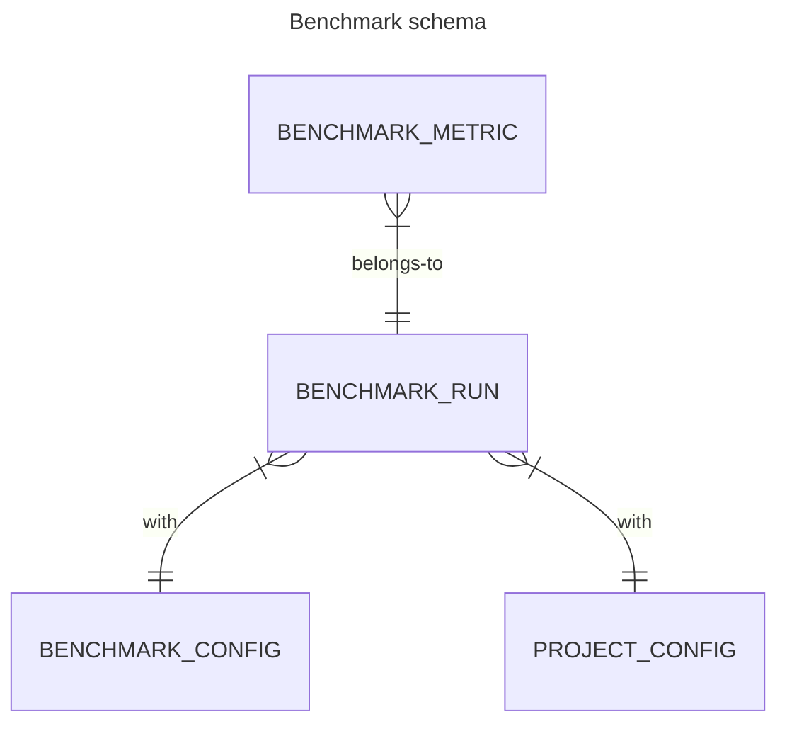

<!--
How to use this template:

- Make a copy of this file in the docs/proposals/ directory
- Set the name of the file to contain the next logical number and the name of the feature
- Fill out at least the Status, Motivation and Goals/Non-Goals fields.
- Open a PR to green-reviews-tooling
- Merge early and iterate

For more tips see the Contributing docs: https://github.com/cncf-tags/green-reviews-tooling/blob/main/CONTRIBUTING.md#proposals
-->

# Proposal 003 - Report project benchmark tests from the automated pipeline

<!--
Keep the title short, simple, and descriptive. A good
title can help communicate what the proposal is and should be
considered as part of any review.
-->

Step 3 in the automated pipeline to report and store the carbon emission results for a CNCF project. 

See also: 
- step 1: [Trigger and Deploy](./proposal-001-trigger-and-deploy.md) 
- step 2: [Run benchmark tests](./proposal-002-run.md).

- Tracking issue: [#95](https://github.com/cncf-tags/green-reviews-tooling/issues/95)
- Implementation issue: TBD

## Authors

- @chrischinchilla
- @AntonioDiTuri
- @rossf7

## Status

WIP

## Table of Contents

<!-- toc -->

- [Proposal 003 - Report project benchmark tests from the automated pipeline](#proposal-003---report-project-benchmark-tests-from-the-automated-pipeline)
  - [Authors](#authors)
  - [Status](#status)
  - [Table of Contents](#table-of-contents)
  - [Summary](#summary)
  - [Motivation](#motivation)
    - [Goals](#goals)
    - [Non-Goals](#non-goals)
    - [Linked Docs](#linked-docs)
  - [Proposal](#proposal)
    - [User Stories (Optional)](#user-stories-optional)
    - [Risks and Mitigations](#risks-and-mitigations)
  - [Design Details](#design-details)
    - [Metrics](#metrics)
    - [Collect](#collect)
    - [Store](#store)
    - [Share](#share)
  - [Drawbacks (Optional)](#drawbacks-optional)
  - [Alternatives](#alternatives)
  - [Infrastructure Needed (Optional)](#infrastructure-needed-optional)

## Summary

<!--
A good summary is at least a paragraph in length and should be written with a wide audience
in mind.

It should encompass the entire document, and serve as both future documentation
and as a quick reference for people coming by to learn the proposal's purpose
without reading the entire thing.

Both in this section and below, follow the guidelines of the [documentation
style guide]. In particular, wrap lines to a reasonable length, to make it
easier for reviewers to cite specific portions, and to minimize diff churn on
updates.

[documentation style guide]: https://github.com/kubernetes/community/blob/master/contributors/guide/style-guide.md
-->

## Motivation

<!--
This section is for explicitly listing the motivation, goals and non-goals of
this proposal. Describe why the change is important, how it fits into the project's
goals and the benefits to users.

It is helpful to frame this to answer the question: "What is the problem this proposal
is trying to solve?"
-->

This proposal is part of the pipeline automation of the Green Reviews tooling for Falco (and new CNCF projects in the future). It builds upon the previous steps of the pipeline to record, report, and store the results of the pipeline. It records, reports, and stores SRE metrics specified by the project as well as standard metrics for carbon emissions based on energy usage.

### Goals

<!--
List the specific goals of the proposal. What is it trying to achieve? How will we
know that this has succeeded?
-->

- Describe the two kind of metrics that are going to be stored:
  - Project-related metrics: specific metrics that a given project might request
  - Sustainability metrics: the metrics related to the green review
- Describe the steps and infrastructure needed to report and store the results of the pipeline:
  - Collect: the action of getting the metrics from their producers
  - Store: the action of saving the metrics in a state
  - Share: how to expose the metrics for the CNCF project maintainers
- For each step describe how the action should be implemented and why

### Non-Goals

<!--
What is out of scope for this proposal? Listing non-goals helps to focus discussion
and make progress.

It is important to remember that non-goals are still equally important things
which will be dealt with one day but are not things which need to be dealt with immediately
within the scope of this work. This helps make sure everyone is crystal clear on the outcomes.
-->

- Create new metrics from scratch 
- Aggregate existing metrics
- Provide analytic functionalities on top of the raw metrics

### Linked Docs

<!--
Provide links to previous discussions, Slack threads, motivation issues or any other document
with context. It is really helpful to provide a "source of truth" for the work
so that people aren't searching all over the place for lost context.
-->

## Proposal

<!--
This is where we get down to the specifics of what the proposal actually is:
outlining your solution to the problem described in the Motivation section.
This should have enough detail that reviewers can understand exactly what
you're proposing, but should not include things like API designs or
implementation. The "Design Details" section below is for the real
nitty-gritty.
-->

### User Stories (Optional)

<!--
Detail the things that people will be able to do if this proposal is implemented.
Include as much detail as possible so that people can understand the "how" of
the system. The goal here is to make this feel real for users without getting
bogged down.
-->

**CNCF project maintainer selects project-related metrics** 

If the project produces significant metrics that need to be monitored along with the sustainable metrics, I would like to have them reported.

**Green reviews maintainer adds, modifies or removes sustainability metrics**

As a Green Review maintainer, I would like to change the sustainability metrics over time. 

**CNCF project maintainer is able to check the metrics for their project**

After the pipeline produces the metrics, I would like to see the result of it in an accessible way.


### Risks and Mitigations

<!--
What are the risks of this proposal, and how do we mitigate?
Think broadly.  For example, consider how this will impact or be impacted
by scaling to support more CNCF Projects.

How will this affect the benchmark tests, CNCF Project Maintainers, pipeline maintainers, etc?
-->

As with every design document there are some challanges:
 
- Consistency vs Flexibility: if we change the sustainability metrics overtime it will be difficult to compare different metrics from different green reviews release. However we would rather be flexible in this first phase and possibly change what we store and how if this leads to more correct results. 
- The three sub-steps of the proposal: Collect, Store and Share are co-dependent. How to collect the data depends on how to store it, and how to store the data depends on how to show it. Since we are still in early phases of the working group, an agile approach will be proposed: a first lean solution will be deployed and, most likely, improved in the future.  

## Design Details

This section will have the following subsections:

- Metrics: what metrics to collect?
- Metadata: what additional data needs to be collected?
- Collect: how to collect the metrics?
- Store: how to store them?
- Share: how to share the metrics?

### Metrics

As already mentioned we will have two sets of metrics:

1. Project-related metrics
2. Sustainability metrics

For the project-related metrics, Falco has requested the following:

```
container_cpu_usage_seconds_total
container_memory_rss
container_memory_working_set_bytes
```

These metrics are provided by cAdvisor and scraped from the kubelet.

For the Sustainability metrics we will store:

`kepler_container_joules_total`

### Metadata

As well as the metrics we will collect additional metadata about the pipeline run. This is to provide context on how the results were measured and to allow results to be compared over time.

This metadata will include at least these attributes and more may be added over time.

- Project name
- Project version (which release was benchmarked)
- Datetime (when the benchmark was performed)
- Project configuration (which configuration was benchmarked)
- Additional info
  - Pipeline version
  - Kubernetes version
  - Kepler version
  - Equinix Metal instance type

### Collect

The Green Reviews pipeline collects the metrics values for the pipeline run so they can be stored. 

**Note:** 2 options are presented for comparison. The proposal will be updated once an option has been selected.

#### Query Prometheus

Query Prometheus directly by running PromQL queries.

**Strengths**

- All metrics are available in Prometheus.
- PromQL queries can be executed against the Prometheus server.

**Weaknesses**

- Dependency on having Prometheus installed in the cluster.
- Executing PromQL queries may need higher level tooling like the Prometheus Go SDK.

#### Scrape the metrics endpoint directly

Collect metrics by making curl requests to the `/metrics` endpoints.

**Strengths**

- Simple.
- Minimal dependencies just needs curl.

**Weaknesses**

- Need to scrape both kepler and kubelet metrics endpoints.
- No ability to make PromQL queries e.g. to calculate a rate of change. We can only use the raw values we scrape.

### Store

Once the results have been calculated they need to be stored along with the additional metadata. 

As an interim step we will write the results to Git at the end of the pipeline run. Long term storage options are considered in the next section. Depending on the option chosen additional design details may be required e.g. database schema for Postgres.

To commit the results to the green-reviews-tooling repo we use a GitHub Bot account and a separate branch to avoid generating conflicts in the main branch.

An example JSON file is shown below.

```json
{
    "run_id": 11538809294,
    "benchmark": {
        "workflow_name": "falco.yml"
    },
    "cncf_project": {
        "name": "falco",
        "org": "falcosecurity",
        "config": "ebpf",
        "version": "0.39.1"
    },
    "meta": {
        "equinix_metal_instance_type": "m3.small.x86",
        "kepler_version": "0.7.12",
        "kubernetes_version": "1.29.0",
        "pipeline_version": "0.1.0"
    },
    "results": {
        "metrics": [
            {
                "name": "container_cpu_usage_seconds_total",
                "value": 25.800365357198253
            },
            {
                "name": "container_memory_rss",
                "value": 953597074.2857143
            },
            {
                "name": "container_memory_working_set_bytes",
                "value": 1070605165.7142856
            },
            {
                "name": "kepler_container_joules_total",
                "value": 7867.507499998423
            }
        ],
        "sci": {
            "components": {
                "energy_consumption": {
                    "units": "kWh",
                    "value": 0.0041
                },
                "emissions_factor": {
                    "region": "France",
                    "units": "gCO2eq/kWh",
                    "value": 78.81
                },
                "embodied_carbon": {
                    "units": "gCO2eq",
                    "value": 3.92
                },
                "pue": {
                    "provider": "Equinix",
                    "value": 1.42 
                }
            },
            "units": "gCO2eq",
            "value":  4.03
        }
    },
    "start_time": "2024-10-27T09:00:00Z",
    "end_time": "2024-10-27T09:15:00Z"
}
```

**Notes:**
- `run_id` is the ID of the GitHub Actions pipeline run.
- `metrics` section contains the raw metric values collected by the pipeline.
- `sci` section has both the overall SCI score and its component parts.
- `start_time` and `end_time` stores the time and duration of the pipeline run.

If we go for a Postgres solution, the schema to store the same data could be something like this:



| Table name  | benchmark_run | |
| ------------- | ------------- | -- |
| run_id | primary key | 11538809294 |
| workflow_name | varchar | "falco.yml" |
| start_time | timestamp | "2024-10-27T09:00:00Z" |
| end_time | timestamp |  "2024-10-27T09:15:00Z" |
| sci_energy_consumption | float not null | 0.0041 |
| sci_emissions_factor | float | 78.81 |
| sci_embodied_carbon | float | 3.92 |
| sci_pue | float | 1.42 |
| sci_total | float | 4.03 |
| benchmark_config_id | foreign key | 123 |
| project_config_id | foreign key | 456 |

| Table name  | benchmark_config | |
| ------------- | ------------- | -- |
| config_id | primary key | 123 |
| equinix_metal_instance_type | varchar |  "m3.small.x86" |
| kepler_version | varchar | "0.7.12" |
| kubernetes_version | varchar | "1.29.0" |
| pipeline_version | varchar | "0.1.0" |

| Table name  | project_config | |
| ------------- | ------------- | -- |
| config_id | primary key | 456 |
| project_name | varchar | "falco" |
| project_org | varchar | "falcosecurity" |
| project_config | varchar | "ebpf" |
| project_version | varchar | "0.39.1" |


| Table name  | benchmark_metric | |
| ------------- | ------------- | -- |
| metrics_id | primary key | 789 |
| benchmark_run_id | foreign key | 11538809294 |
| key_name | text not null | "container_cpu_usage_seconds_total" |
| metrics_value | float no null | 25.800365357198253 |


Notes:
- `sci_energy_consumption` is the most important value because it will allow CNCF projects to compare performance between runs.
- In the database it's not necessary to store the unit for the different values, we just make sure it's well documented and stick to the same unit every time.
- We store the benchmark configurations in a separate table because these will most of the times be the same, so we can deduplicate the data. We can then also identify what bencharking runs we performed with which environment, if we later change the setup.
- The same with the project configuration (maybe not quite so with the project version, though...).
- The `benchmark_metrics` table contains data which we want to collect differently per project and is not fixed, so we use 


### Long Term Storage Options

Once the results have been generated in the chosen data format we need a long term storage option.

**Note:** 3 options are presented for comparison. The proposal will be updated once an option has been selected.

- Object Storage (S3 compatible)
- In Cluster Storage (with external backup)
- External database (CNCF DevStats Postgres cluster)

#### Object Storage (S3 compatible)

**Strengths**

- Simple.
- External backup outside of the cluster.

**Weaknesses**

- Data is private and not publicly accessible.
- Not interactive so no ability to compare results.

2 hosting options.

**AWS S3**

**Strengths**

- Simple and no infra to manage.
- We already have S3 bucket in CNCF AWS account for storing cluster OpenTofu state files.

**Weaknesses**

- Proprietary cloud service.
- Need to check we can use existing bucket for storing more data.

**MinIO**

Run [Equinix Metal node](https://deploy.equinix.com/developers/guides/minio/) running [MinIO](https://github.com/minio/minio). 

**Strengths**

- S3 compatible but not a proprietary service.
- Open Source (AGPL license).

**Weaknesses**

- Involves running an additional Equinix Metal server.
- Still needs external backup in case server fails.

#### In Cluster Storage with external backup

Current cluster runs K3s which can be configured to use [local storage](https://docs.k3s.io/storage).
We would still need an external backup but we could use object storage for this.

**Strengths**

- Cluster already has Prometheus and Grafana deployed.
- Existing Grafana dashboard can be adapted to support the collected results.
- Dynamic queries like comparing results can be implemented.

**Weaknesses**

- We still need an external backup of the results (we could use S3 for this).
- Needs a cluster with at least one node running 24/7.

#### CNCF DevStats Postgres Cluster

We have the long term goal of presenting the Green Reviews results in the CNCF [DevStats](https://github.com/cncf/devstats) Grafana dashboards.

Displaying the results in DevStats Grafana is out of scope of this proposal but storing the results in the DevStats Postgres database would be an intermediate step in this direction.

**Note:** WIP: We are discussing with the DevStats team if this is an option and if so how it would work.

**Strengths**

- Results are stored outside of the cluster.
- Dynamic queries like comparing results can be implemented.
- Gets us closer to displaying results in DevStats Grafana.

**Weaknesses**

- Dependency on external team and may need changes on their side.

### Share

TBD

Grafana dashboard is needed?
Is it enough to show the markdown files?


<!--
This section should contain enough information that the specifics of your
change are understandable. This may include manifests or workflow examples
(though not always required) or even code snippets. If there's any ambiguity
about HOW your proposal will be implemented, this is the place to discuss them.
-->


## Drawbacks (Optional)

JSON storage isn't so viable in the long term, this is an MVP solution and in the long term, will store metrics in a Prometheus-compatible storage solution.

## Alternatives

<!--
What other approaches did you consider, and why did you rule them out? These do
not need to be as detailed as the proposal (pros and cons are fine),
but should include enough information to express the idea and why it was not acceptable
as well as illustrate why the final solution was selected.
-->

## Infrastructure Needed (Optional)

<!--
Use this section if you need things from the project/SIG. Examples include a
new subproject, repos requested, or GitHub details. Listing these here allows a
SIG to get the process for these resources started right away.
-->
