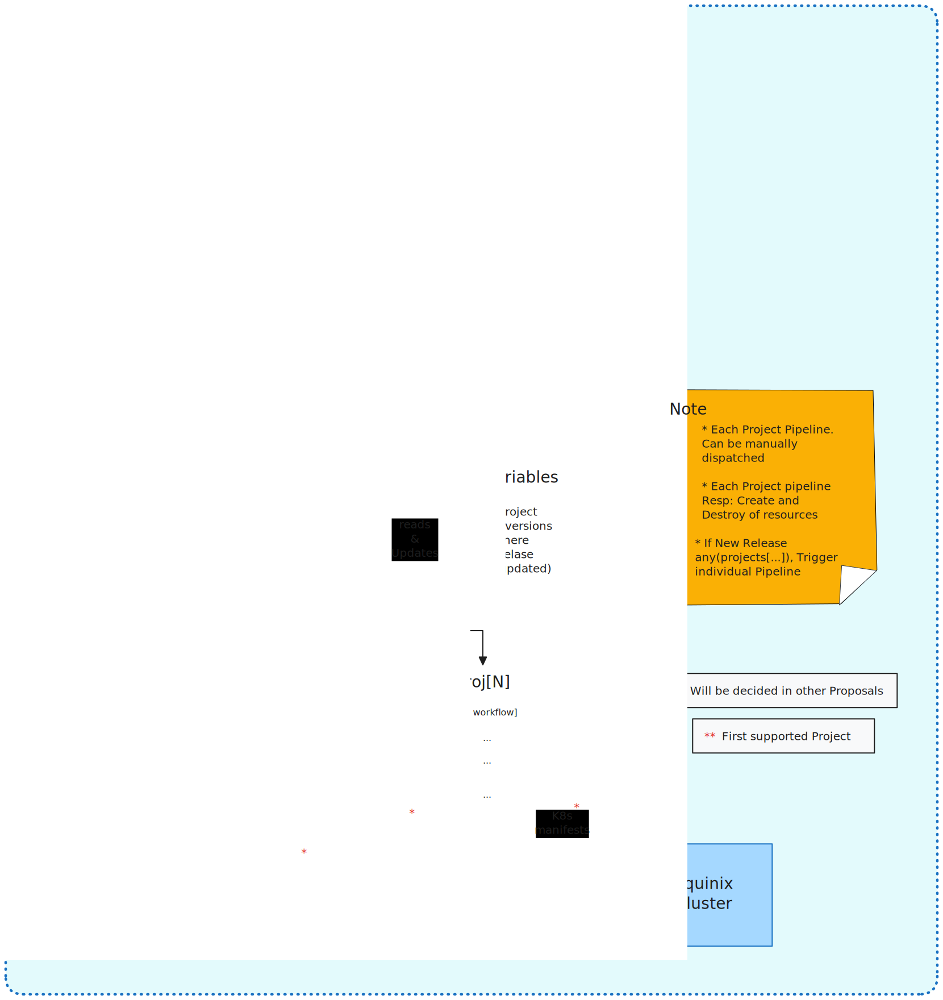

# Proposal-001 - Trigger and Deploy GitHub Action workflow from an upstream CNCF project

To trigger our benchmarking task to run when a particular CNCF project gets certain kinds of event, such as a new `release`.

- Tracking issue: [#83](https://github.com/cncf-tags/green-reviews-tooling/issues/83)
- Implementation issue: [#84](https://github.com/cncf-tags/green-reviews-tooling/issues/84)

## Authors

- @rossf7
- @dipankardas011

## Status

implementable

<!--
Must be one of provisional, implementable, implemented, deferred,
rejected, withdrawn, or replaced.
-->

## Table of Contents
<!-- toc -->
- [Summary](#summary)
- [Motivation](#motivation)
  - [Goals](#goals)
  - [Non-Goals](#non-goals)
  - [Linked Docs](#linked-docs)
- [Proposal](#proposal)
  - [User Stories](#user-stories)
  - [Risks and Mitigations](#risks-and-mitigations)
- [Design Details](#design-details)
  - [Graduation Criteria (Optional)](#graduation-criteria-optional)
- [Drawbacks (Optional)](#drawbacks-optional)
- [Alternatives](#alternatives)
- [Infrastructure Needed](#infrastructure-needed)
<!-- /toc -->

## Summary

This proposal focuses on automating the Green Reviews pipeline for Falco by 
defining a trigger mechanism, involving the Falco team in the implementation, 
deploying Falco using Flux, and testing the deployment process. In future the 
pipeline will support more CNCF projects as they are onboarded.

The proposal also includes considerations for a phased implementation of the 
automation, starting with manual triggering followed by automation via a webhook.

The high level architecture is shown in this diagram.


## Motivation

To automate the trigger of Falco deployment when upstream aka origin repo 
creates a new release. We will then deploy the benchmarking workload for the 
project, in this case Falco.

### Goals

- For adding *new projects* in our SCI benchmarking pipeline
  - **They** need to specify what their benchmarking pipeline looks like aka 
    script to be used. See proposal [#2](https://github.com/cncf-tags/green-reviews-tooling/issues/83)
  - **They** need to define any specific requirement for the project during 
    the benchmark
  - **They** need to help in setting up the configurations required to enable 
    benchmarking job manifests in **Our** repo
  - **We** need to trigger the pipeline when a new release happens for their project
  - **We** need to give permission to call out *green-reviews* GitHub action
  - **We** need to document the solution including how to onboard new CNCF projects
  - **Our** GitHub actions will look for manifests or other resources to 
    deploy the benchmarking job
- We need to make evaluation of SCI score **independent** irrespective of projects.  See proposal [#3](https://github.com/cncf-tags/green-reviews-tooling/issues/83)
- Our Current Sub-Goals aka current plan to accomplish
  - Trigger GitHub Action workflow in green-reviews-tooling repo when 
    a new release of Falco needs to be tested
  - Deploy correct version of Falco in GitHub Action using Flux
  - Test the deployment via the Falco trigger

### Non-Goals

- Creating cluster nodes on demand. [Future Goal Issue #67](https://github.com/cncf-tags/green-reviews-tooling/issues/67)

### Linked Docs

- **Slack Discussion Thread** [Link](https://cloud-native.slack.com/archives/C060EDHN431/p1712765271470189)
- **Triggering GitHub Action**: For triggering the workflow AIUI we could use a 
webhook to trigger a workflow_dispatch event. [Workflow Dispatch](https://docs.github.com/en/actions/using-workflows/events-that-trigger-workflows#workflow_dispatch). 
It allows providing custom inputs and as a minimum I think we need the name of the CNCF project and the version to be deployed. [Providing Inputs for event that trigger workflows](https://docs.github.com/en/actions/using-workflows/events-that-trigger-workflows#providing-inputs)

## Proposal

We will watch for new releases of the project by subscribing to the Atom feed
of releases that GitHub publish e.g. https://github.com/falcosecurity/falco/releases.atom

Our automation will call a GitHub webhook to trigger the green reviews pipeline
in our tooling repo.

See this example curl command and related [workflow](./files/trigger-deploy.yml)

```bash
curl -X POST \
     -H "Accept: application/vnd.github.v3+json" \
     -H "Authorization: token $GITHUB_PAT" \
     https://api.github.com/repos/cncf-tags/green-reviews-tooling/actions/workflows/pipeline.yaml/dispatches \
     -d '{"ref":"main", "inputs": {"cncf_project": "falco", "cncf_project_sub": "modern-ebpf","version":"0.37.0"}}'
```

The maintainers of the CNCF projects will also be able to call this webhook
using a fine grained access token we will provide.

This can be used to trigger the pipeline ad-hoc during development and can be
added to their CI/CD pipeline if additional trigger points are required.

### User Stories

#### Project maintainer creates new release to be measured

Our automation detects a new release was published and triggers the green
reviews pipeline. The Report stage will provide the results to users of the
project.

#### Project maintainer deploys their project so it can be measured

Participating CNCF projects will deploy their project using a gitops approach
with flux. This is described in more detail in the design details section.

#### Project maintainer triggers pipeline to test a new benchmark

Calling the webhook will trigger the pipeline allowing the changes to be tested.

### Risks and Mitigations

Multiple deployments will produce inaccurate results as we can only accurately
measure a single project per node. We can set concurrency in the workflow to
ensure only a single instance runs at a time.

Deployment may fail. What alerting do we need? Do we also need to notify the
project?

Uninstall at end of pipeline fails. We can wait till all flux finalizers are
removed. In future we could create nodes on demand and delete on completion.

## Design Details



### Subscribing to Releases

A YAML file of CNCF projects and any sub components will be stored in the
tooling repo e.g.

```yaml
# projects.yaml
projects:
  - name: falco
    sub_components:
      - ebpf
      - modern-ebpf
      - kmod
```

A scheduled GitHub Action will run every 30 minutes and check the Atom feed of
each project for new releases. To manage the state a GitHub [repository variable](https://docs.github.com/en/actions/learn-github-actions/variables)
per CNCF project is used to store the latest release version.

If a new release is detected the action will trigger the pipeline for the new
release and update the variable with the new version. This is to ensure each
release is only triggered once.

If sub components are specified then the pipeline will be triggered once per
sub component.

### Trigger

The green reviews pipeline will be triggered by sending a [workflow_dispatch](https://docs.github.com/en/actions/using-workflows/events-that-trigger-workflows#workflow_dispatch)
event via its GitHub webhook.

Inputs are

- `cncf_project`: **required** Project to be deployed e.g. `falco`
- `cncf_project_sub`: **optional** Subcomponent if project has multiple variants
they wish to test e.g. `modern-ebpf`
- `version`: **required** Version of project to be tested e.g. `0.37.0`

```sh
curl -X POST \
     -H "Accept: application/vnd.github.v3+json" \
     -H "Authorization: token $GITHUB_PAT" \
     https://api.github.com/repos/cncf-tags/green-reviews-tooling/actions/workflows/pipeline.yaml/dispatches \
     -d '{"ref":"main", "inputs": {"cncf_project": "falco", "cncf_project_sub": "modern-ebpf","version":"0.37.0"}}'
```

The CNCF projects will be given a GitHub fine grained access token limited to
the `green-reviews-tooling` repo. This token will have

- Read access to code and metadata
- Read write access to actions

### Deploy

Flux is used to deploy the CNCF project. Projects are able to use either
`kustomization` or `helmrelease` resources to deploy their project.

When the pipeline executes it will look for manifest files in the projects dir.
If there is a manifest matching the `cncf_project` input its contents will be
applied using kubectl. The same applies for the `cncf_project_sub` input. 

The `version` param is injected into the files to ensure the correct version of
the project is deployed. (For these minor changes we can utilize kustomize)

```
projects
└── falco
    ├── ebpf.yaml
    ├── falco.yaml
    ├── kmod.yaml
    └── modern-ebpf.yaml
```

The pipeline will use a GitHub secret that has a kubeconfig to access the
green reviews cluster. The deploy step in the pipeline will wait for the newly
created flux resources to be reconciled before proceeding to the run step.

We will have a node to deploy Falco and another to run the benchmarks
so we will use [concurrency](https://docs.github.com/en/actions/using-jobs/using-concurrency)
to only allow a single execution of the pipeline at any one time.

The separate nodes are a best practice to prevent other components affecting
the energy measurements.

### Cleanup

On completion of the pipeline whether it was successful or failed the flux
resources will be deleted via kubectl. The pipeline will wait for the flux
resources to be deleted before exiting.

This is to ensure that the cluster state is clean before the next execution of
the pipeline.

### Graduation Criteria (Optional)

<!--
List criteria which would allow progression from one maturity level to another.
eg. What needs to have been accomplished/demonstrated to move from Alpha to Beta.

If applicable, what is the milestone marker which will allow deprecation of the
replaced capability?
-->

## Drawbacks (Optional)

<!--
What other approaches did you consider, and why did you rule them out? These do
not need to be as detailed as the proposal, but should include enough
information to express the idea and why it was not acceptable.
-->

## Alternatives

<!--
What other approaches did you consider, and why did you rule them out? These do
not need to be as detailed as the proposal (pros and cons are fine),
but should include enough information to express the idea and why it was not acceptable
as well as illustrate why the final solution was selected.
-->

## Infrastructure Needed (Optional)

<!--
Use this section if you need things from the project/SIG. Examples include a
new subproject, repos requested, or GitHub details. Listing these here allows a
SIG to get the process for these resources started right away.
-->

- GitHub access token for CNCF projects
